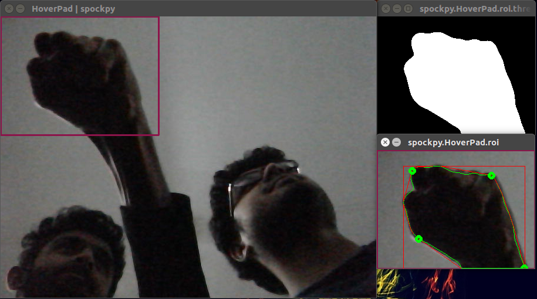
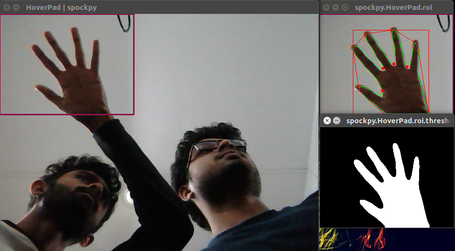
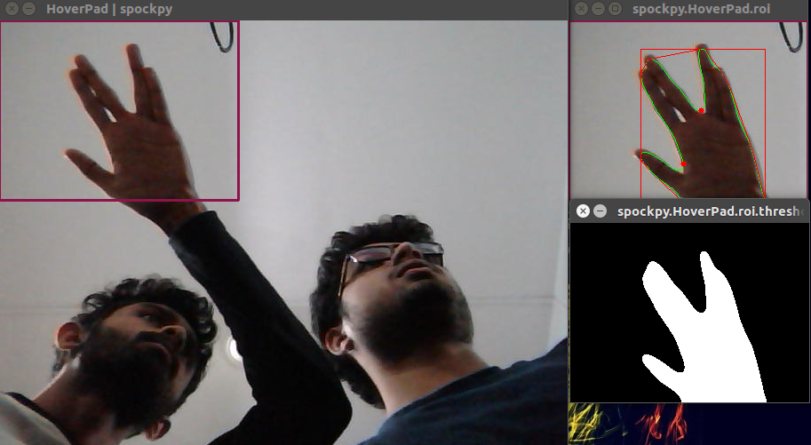
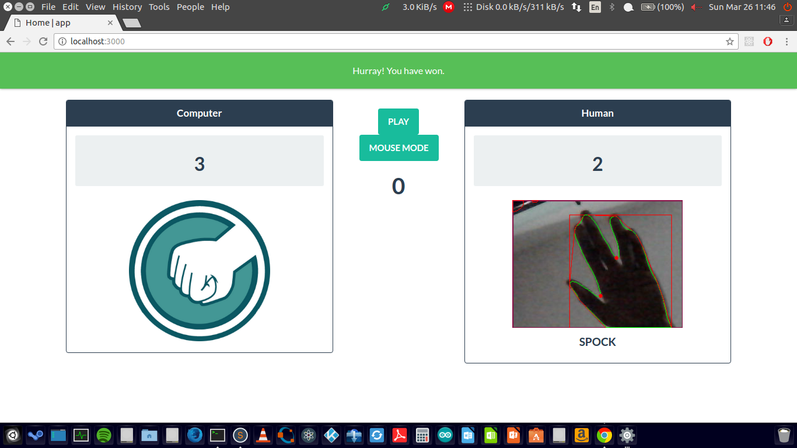
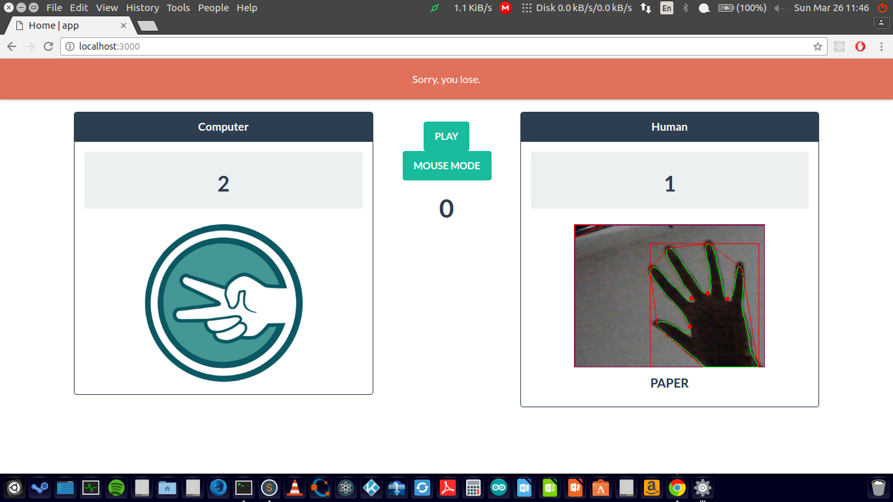
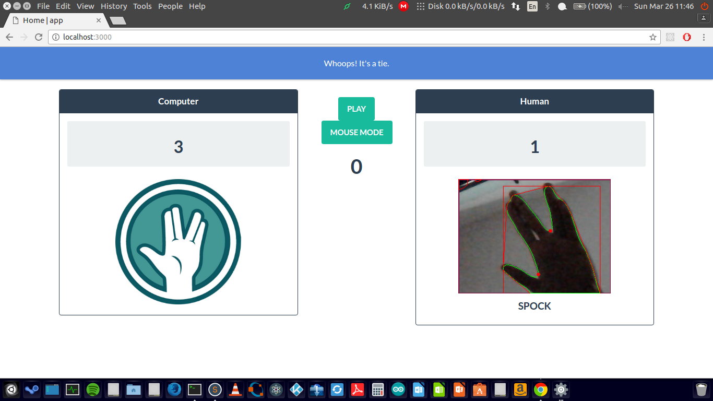

# spockpy
> A Python library for hand gestures as an input interface.


### Table of Contents
* [Installation](#installation)
* [Usage](#usage)
* [Examples](#examples)
* [License](#license)

### Installation
Download or clone the repository onto your desktop
```console
$ git clone https://github.com/achillesrasquinha/spockpy && cd spockpy
```

Install necessary dependencies
```console
$ pip install -r requirements.txt
```

Go ahead and install it onto your system.
```console
$ python setup.py install
```

### Usage
spockpy creates a virtual trackpad (we call this, a *HoverPad*) for your user to interact with the API. Create a `spockpy.HoverPad` object as follows:
```python
>>> import spockpy
>>> pad = spockpy.HoverPad(verbose = True)
```

To display the `HoverPad`, use the `show` class method as follows:
```python
>>> pad.show()
```

### How about Rock?


### What about Paper?


### Also, maybe Spock?


`spockpy.HoverPad` releases a set of event objects from the `event` class method

### Examples
spockpy comes with a handy number of examples.
To launch the app, launch it as follows:
```python
>>> import spockpy
>>> app = spockpy.App()
>>> app.run()
```
OR via the command-line
```console
$ python -m spockpy
```





###

### License
This repository has been released under the [Apache License 2.0](LICENSE)